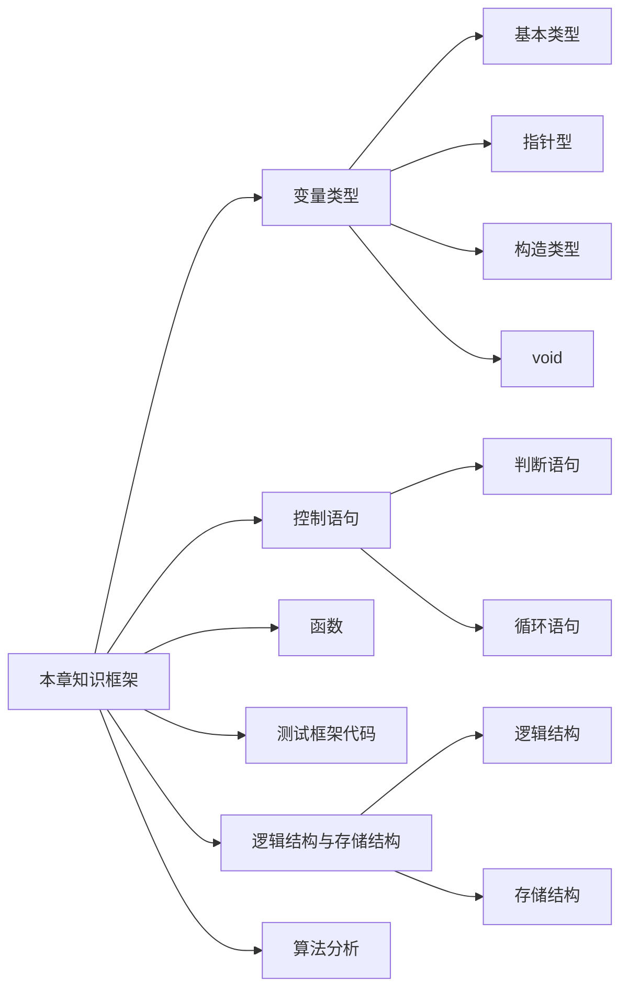

# 总结

- 变量类型

  > 基本类型

  > 指针型

  > 构造类型

  > void

- 控制语句

  > 判断语句

  > 循环语句

- 函数

- 测试框架代码

- 逻辑结构与存储结构
  > 逻辑结构：没关系、一对一、一对多、多对多

  > 存储结构：顺序存储、链式存储

- 算法分析
  > 时间复杂度分析
  
  > 补充求T(n)常考题型

```mermaid
graph LR
    C[本章知识框架]
    C --> F1[变量类型] --> F11[基本类型]
          F1[变量类型] --> F12[指针型]
          F1[变量类型] --> F13[构造类型]
          F1[变量类型] --> F14[void]

    C --> F2[控制语句] --> F21[判断语句]
          F2[控制语句] --> F22[循环语句]
    C --> F3[函数]
    C --> F4[测试框架代码]
    C --> F5[逻辑结构与存储结构] --> F51[逻辑结构]
    
          F5[逻辑结构与存储结构] --> F52[存储结构]
    C --> F6[算法分析]
```

